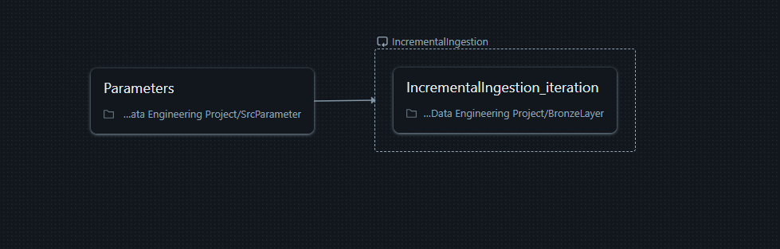
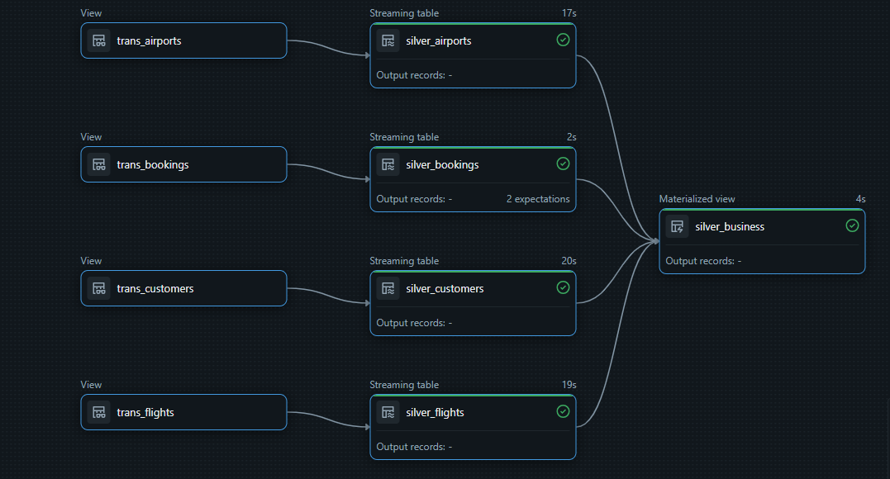

# ✈️ Flights Data Engineering Project with Delta Lake & LakeFlow

## 📌 Objective

The objective of this project is to design and implement a scalable, end-to-end **Medallion Architecture** for flight data processing using Databricks, Delta Lake, and LakeFlow (Delta Live Tables). The pipeline supports **incremental ingestion**, **schema validation**, **rule-based quality checks**, and **automated star schema generation** for advanced analytics.

---

## 🔄 End-to-End Pipeline Flow

This project implements the following key components:

- ✅ **Bronze Layer (Raw Ingestion)**:
  - Uses **PySpark Streaming** and **Auto Loader** for **incremental ingestion** from a raw landing zone.
  - Controlled by a **parameterized control flow** and dynamic source configuration.
  - Ensures idempotent ingestion with schema enforcement.

  

- ✅ **Silver Layer (Transformation & CDC)**:
  - Orchestrated with **LakeFlow Declarative Pipelines** using **Delta Live Tables**.
  - Implements **data quality rules**, **schema validation**, and **Change Data Capture (CDC)** using SCD Type 1 logic to maintain latest records.

  

- ✅ **Gold Layer (Star Schema Builder)**:
  - Dynamically generates dimension and fact tables and handles SCD automatically using **Slowly Changing Dimension (SCD) Builder**.
  - Supports historical tracking for analytical use cases.

---

## 🗂️ Folder Structure

```bash
flights-data-engineering/
├── README.md
├── images/
│   ├── bronze_ingestion.png              # Image showing raw to bronze ingestion with control flow
│   └── silver_lakeflow_orchestration.png # Image showing silver layer orchestration with DLT
├── script/
│   ├── bronze/
│   │   └── bronze_ingestion.py
│   ├── silver/
│   │   └── silver_transformation.py
│   ├── gold/
│   │   ├── gold_dim_builder.py
│   │   └── gold_fact_builder.py
│   └── initialization/
│       ├── setup_schema_volume.py
│       └── source_parameters.py
